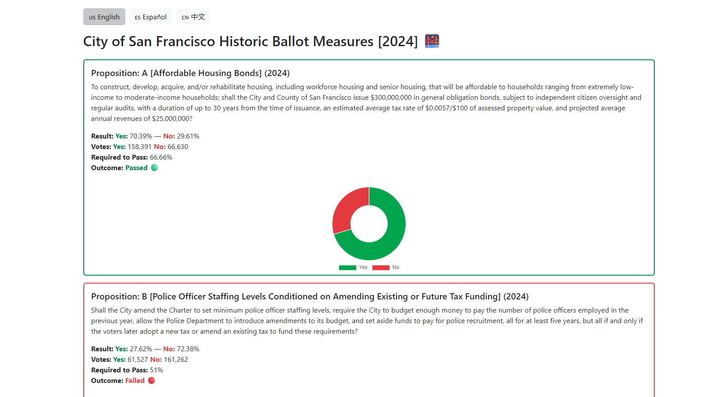
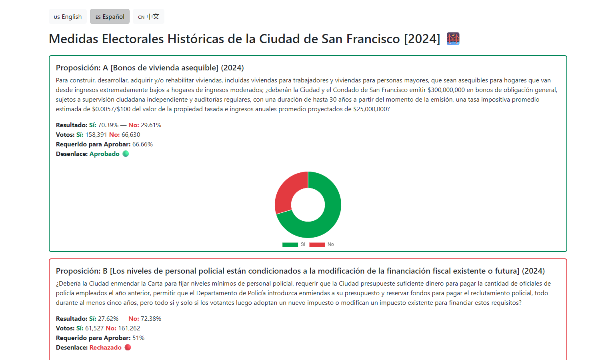
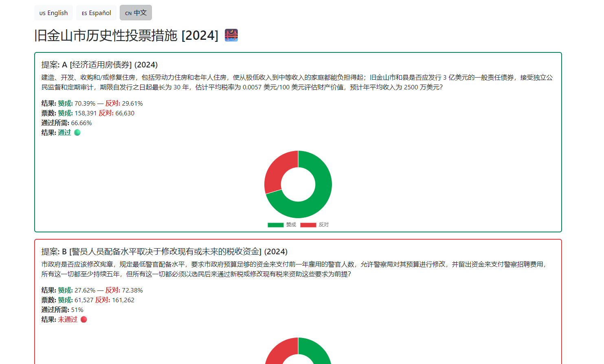

# City of San Francisco Historic Ballot Measures Explorer 🌉

This project provides an interactive web application to explore historic ballot measures and propositions within the City of San Francisco. It allows users to view detailed information about each measure, visualize voting results with dynamic charts, and access all content in multiple languages for enhanced accessibility.

## Tech Stack

**Client:** 
- `React`, `NextJS`, `TailwindCSS`, `i18n`, `Chart.js`, `Axios`, `BootstrapCSS`

**Server:** 
- `PHP`, `MySQL`

**Local Dev Env:** 
- `XAMPP`

## Screenshots
# English  
  

# Spanish  
  

# Chinese  
  

